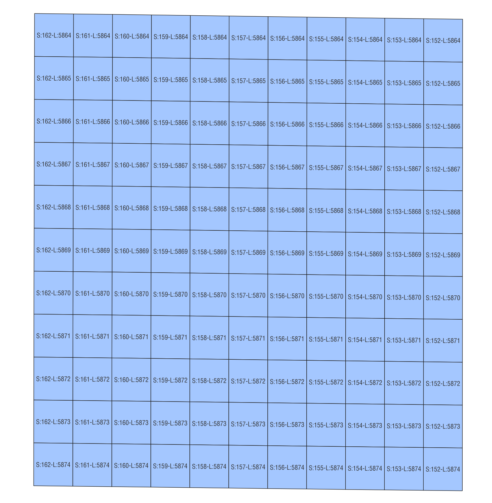

===============
Pixel to Vector
===============
*Geospatial Vector Representation of Remote Sensing Hyperspectral Data*

---------------------------------

.. image:: https://img.shields.io/pypi/v/pix2vec.svg
        :target: https://pypi.python.org/pypi/pix2vec

.. image:: https://img.shields.io/travis/afrigeri/pix2vec.svg
        :target: https://travis-ci.com/afrigeri/pix2vec

.. image:: https://readthedocs.org/projects/pix2vec/badge/?version=latest
        :target: https://pix2vec.readthedocs.io/en/latest/?version=latest
        :alt: Documentation Status

Vector Representation of Hyperspectral Data

* Free software: GNU General Public License v3
* Documentation: https://pix2vec.readthedocs.io.

Features
--------

* Produces a vector representation of the raster representation of HSI data 'cubes' generated by ISIS

Requirements
------------

* a relatively recent ISIS installation

Cite in your work
-------------------

Frigeri, A. and Hare, T. 2023. Geospatial Vector Representation of 
Planetary Mapping Spectrometer Data. 6th Planetay Data Workshop, Flagstaff, Arizona 26-28th June 2023, Abstract #7088.

installation
------------

within a working ISIS environment, run:

    pip install pix2vect

pix2vec in brief
-----------------

`pix2vect` requires spice-initialized ISIS cubes (see `spiceinit`).  

Get some info about a M3 cube::

    (ISIS) hopi:pix2vec alf$ pix2vec -i -c M3G20090103T084105_V03_L1B.cub 
    pix2vect - 2023 Alessandro Frigeri - Istituto Nazionale di Astrofisica
    Cube Type:M3 samples:304 lines:11739 file:M3G20090103T084105_V03_L1B.cub

Let's extract the central portion of the image::

    pix2vec -c M3G20090103T084105_V03_L1B.cub -s 152,162 -l5864,5874 -o M3G20090103T084105_V03_L1B_center.gpkg 

resulting into:

Documentation
-------------

Documentation is available at https://pix2vec.readthedocs.io

Credits
-------

This package was created with Cookiecutter_ and the `audreyr/cookiecutter-pypackage`_ project template.

.. _Cookiecutter: https://github.com/audreyr/cookiecutter
.. _`audreyr/cookiecutter-pypackage`: https://github.com/audreyr/cookiecutter-pypackage
